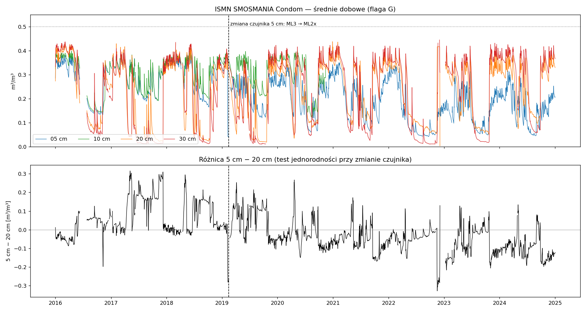

# Kontrola jakości danych referencyjnych — ISMN SMOSMANIA Condom

> **Data:** 2026-09-26 · **Status:** `Draft` (analiza eksploracyjna; reguły QC wdrożone w `step_07_station_pipeline.py`, funkcja `qc_insitu`)
> **Dane:** `data/7_isismn_data/SMOSMANIA/Condom/*.stm` (ISMN, 2016-01-01 → 2025-01-01, godzinowe), tylko rekordy z flagą `G`

## Stacja

- 43,9744°N, 0,3361°E, 174 m n.p.m.
- Pokrycie terenu (ESA CCI 300 m): uprawy nienawadniane z drzewami/krzewami. **Czujnik stoi na otwartym polu, nie w winnicy.**
- Gleba (in situ): glina ~41–46% iłu, porowatość ~0,50 m³/m³.

| Głębokość | Czujnik | Okres | Rekordy `G` |
|---|---|---|---:|
| 5 cm | ThetaProbe ML3 | 2016-01 → 2019-02 | 24 666 |
| 5 cm | ThetaProbe ML2x | 2019-02 → 2024-12 | 50 257 |
| 10 cm | ML3 | 2016-01 → 2020-11 | 39 546 |
| 20 cm | ML3 | 2016-01 → 2024-12 | 75 620 |
| 30 cm | ML3 | 2016-01 → 2024-12 | 74 868 |

## Ustalenia (błędy, których flaga `G` nie wychwytuje)

| ID | Problem | Dowód | Decyzja |
|---|---|---|---|
| QC-1 | **Artefakt przy wymianie czujnika 5 cm** | 2019-02-06 → 2019-02-21: 5 cm spada do 0,04 m³/m³, a 10/20/30 cm pozostają ~0,32–0,37 (zima, glina). Rekordy mają flagę `G` | Wykluczyć 2019-02-06 → 2019-02-21 |
| QC-2 | **Niejednorodność serii 5 cm (skok poziomu)** | Różnica 5 cm − 20 cm: ML3 średnio **+0,066**, ML2x średnio **−0,046**. Klimatologia miesięczna 5 cm niższa po wymianie o 0,07–0,14 w każdym miesiącu, podczas gdy 20/30 cm (ten sam czujnik) bez zmian | Dwa **niezależne segmenty** 5 cm; brak wspólnej klimatologii i wspólnego biasu |
| QC-3 | **Możliwy dryf ML2x od końca 2022** | Maksimum sezonu mokrego 5 cm: 0,39–0,40 (2016–19) → 0,34–0,35 (2020–22) → 0,30–0,32 (2023–24); 20 cm stabilnie 0,40–0,44. Część spadku może być klimatyczna (sucha zima 2023) | Metryki raportowane per rok; weryfikacja triple collocation (satelita, ERA5-Land, in situ) |
| QC-4 | **Utrata kontaktu czujników 20/30 cm latem** | Wartości 0,01–0,05 m³/m³ w glinie o 46% iłu (fizycznie mało prawdopodobne); skoki dzienne do 0,33; 2017: 192 dni < 0,05 | 20/30 cm < 0,05 oznaczać jako `SUSPECT_CONTACT_LOSS`; walidacja strefy korzeniowej głównie w sezonie mokrym (XI–V) |
| QC-5 | **Zamrożona wartość 20 cm** | 2022-11-16 → 2022-12-05: stałe 0,417 | Wykluczyć; test „brak zmiany > 7 dni” |
| QC-6 | Luki | 47 dni w 2016 (VI–VII); 10 cm kończy się w XI 2020 | Raportować; brak imputacji |

## Konsekwencje dla walidacji

1. **Metryki odporne na przesunięcie poziomu są główne:** R, ρ Spearmana, R anomalii (35 dni) liczone **w obrębie segmentu**. ubRMSD po skalowaniu wyznaczonym w części kalibracyjnej segmentu. Bias raportowany per segment, bez interpretacji jako błąd satelity.
2. **Klimatologia do anomalii długoterminowych** tylko z segmentu ML2x (2019-02-22 → 2024-12, ~5,8 roku).
3. **Podział czasowy** w obrębie segmentu ML2x: kalibracja 2019-03 → 2021-12, test 2022–2024. Segment ML3 (2016–2019) jako dodatkowy, niezależny test dynamiki.
4. **Strefa korzeniowa (0–30 cm):** walidacja z flagą QC-4; wyniki letnie osobno.
5. **Jedna stacja nie wystarczy.** Te same testy QC trzeba uruchomić dla pozostałych stacji SMOSMANIA przed walidacją sieciową.

## Wartość dla portfolio

Pokazuje, że walidacja nie polega na ślepym ufaniu danym referencyjnym. Automatyczne flagi ISMN przepuściły artefakt wymiany czujnika, zamrożoną wartość i utratę kontaktu w glinie pęczniejącej.
